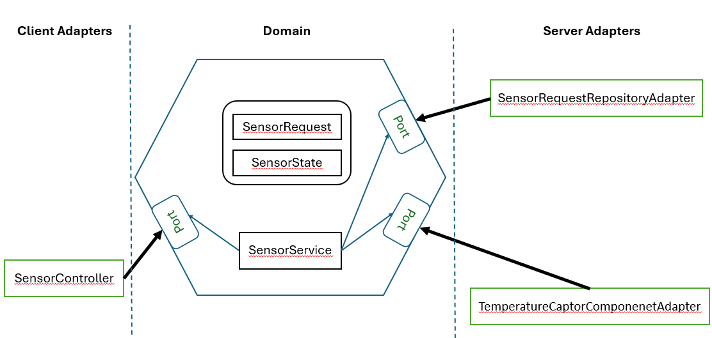

**Objectifs:**
Develop a web app using hexagonal architecture

**Implementation**
# Sensor temperature 
This project was developed to manage temperature sensors and provide weather information.

# technical architecture 
This application is implemented using hexagonal architecture and TDD

## REST API

- GET /api/sensor/temperature
- GET /api/sensor/state
- GET /api/sensor/history